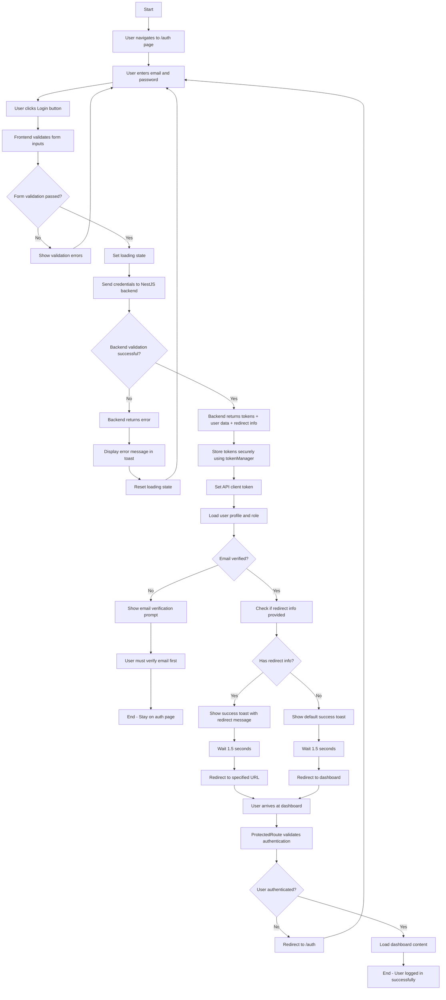
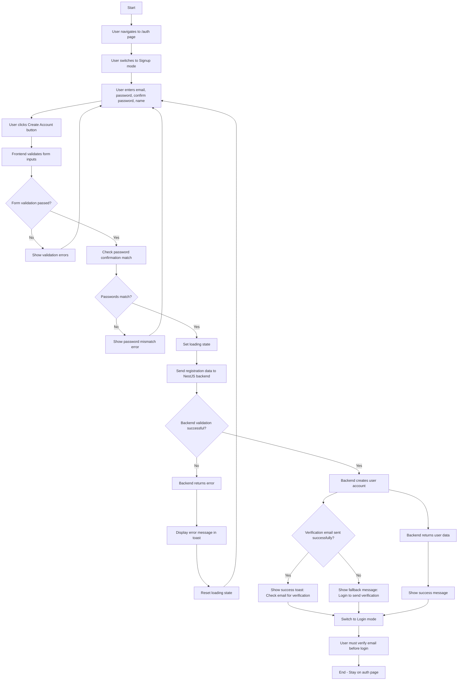
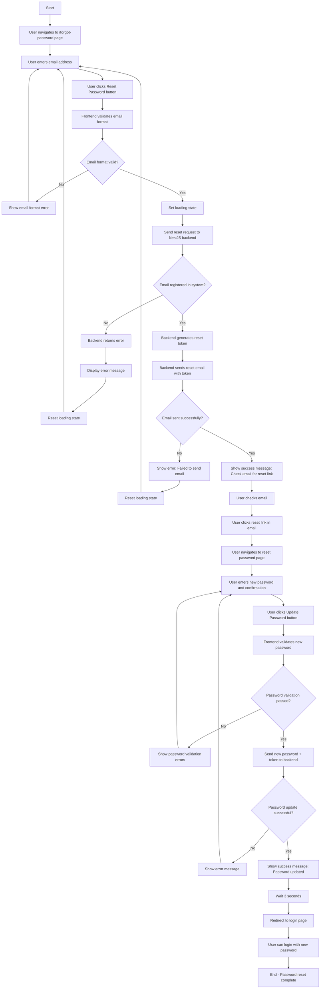
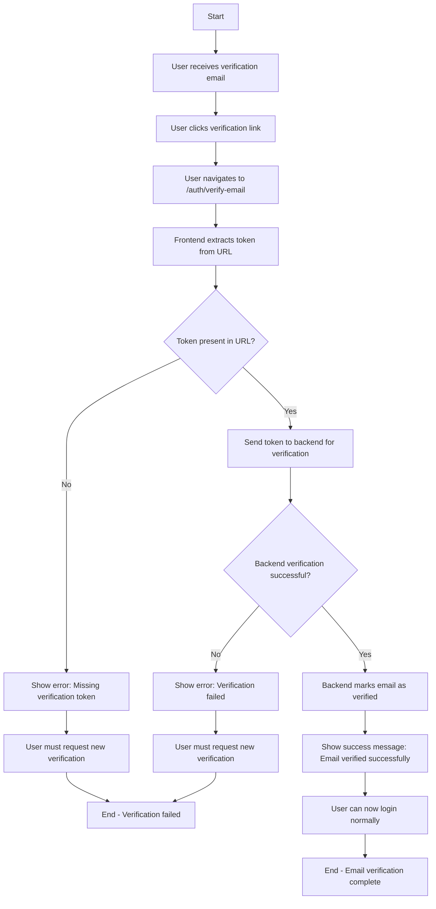
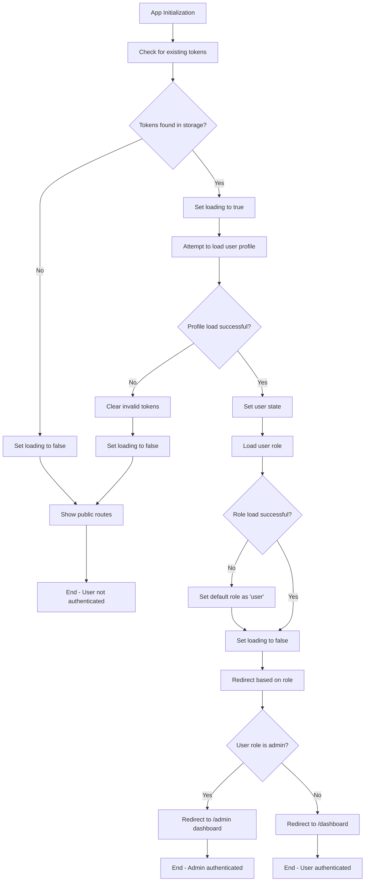

# Authentication Flowcharts

This document contains comprehensive flowcharts for the authentication processes in the Arzan Site application.

## 1. Login Flowchart

## 2. Signup Flowchart

## 3. Reset Password Flowchart

## 4. Email Verification Flowchart

## 5. Authentication State Management Flowchart

## Key Features of the Authentication System

### Security Features
- **JWT Token Management**: Secure storage and automatic refresh
- **Route Protection**: Protected routes using ProtectedRoute component
- **Email Verification**: Required before allowing login
- **Password Validation**: Strong password requirements
- **Session Management**: Automatic token refresh and cleanup

### User Experience Features
- **Persian Language Support**: Localized messages and UI
- **Toast Notifications**: Success and error feedback
- **Loading States**: Visual feedback during operations
- **Automatic Redirects**: Seamless navigation after actions
- **Form Validation**: Real-time input validation

### Technical Features
- **NestJS Backend Integration**: RESTful API communication
- **React Router**: Client-side routing with protection
- **Context API**: Centralized authentication state
- **TypeScript**: Type-safe implementation
- **Responsive Design**: Mobile-friendly interface

## Testing Scenarios

### Login Testing
1. Valid credentials → Success redirect
2. Invalid credentials → Error message
3. Unverified email → Verification prompt
4. Admin user → Admin dashboard redirect
5. Regular user → User dashboard redirect

### Signup Testing
1. Valid data → Account creation + verification email
2. Duplicate email → Error message
3. Weak password → Validation error
4. Password mismatch → Confirmation error

### Password Reset Testing
1. Valid email → Reset email sent
2. Invalid email → Error message
3. Valid token → Password update
4. Expired token → Error message

### Email Verification Testing
1. Valid token → Email verified
2. Invalid token → Error message
3. Missing token → Error message
