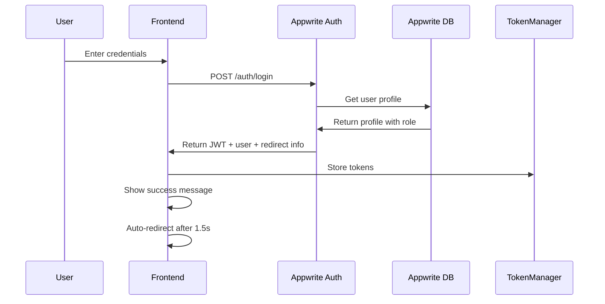

# Role-Based Authentication Redirect Implementation

## Overview

This document explains how the ArzanSite frontend now implements automatic role-based redirects after user login using Appwrite authentication.

## Problem Solved

Previously, users were not being automatically redirected to the appropriate dashboard based on their role after login. The system now:

1. **Automatically detects user role** during login
2. **Redirects admin users** to `/admin` dashboard
3. **Redirects regular users** to `/dashboard`
4. **Shows appropriate success messages** with redirect information

## Implementation Details

### 1. Appwrite Authentication Service (`src/lib/appwriteAuth.ts`)

The new `AppwriteAuthService` handles all authentication operations:

```typescript
class AppwriteAuthService {
  // Sign in user with automatic role detection
  async signIn(email: string, password: string): Promise<AuthResponse> {
    const session = await account.createEmailSession(email, password);
    const user = await account.get();
    const profile = await this.getUserProfile(user.$id);
    
    // Create JWT session
    const jwt = await account.createJWT();
    
    // Determine redirect URL based on role
    const redirectUrl = profile.role === 'admin' ? '/admin' : '/dashboard';
    
    return {
      access_token: jwt.jwt,
      refresh_token: session.$id,
      user: profile,
      redirect: {
        url: redirectUrl,
        message: `Login successful! Redirecting to ${profile.role === 'admin' ? 'admin' : 'user'} dashboard...`
      }
    };
  }
}
```

### 2. Updated Authentication Hook (`src/hooks/useAuth.tsx`)

The `useAuth` hook now integrates with Appwrite instead of the custom NestJS backend:

```typescript
const signIn = async (email: string, password: string) => {
  setError(null);
  try {
    const response = await appwriteAuthService.signIn(email, password);
    
    if (response?.access_token) {
      tokenManager.setTokens({
        access_token: response.access_token,
        refresh_token: response.refresh_token,
      });
      await loadUser();
      return { 
        user: response.user,
        redirect: response.redirect
      };
    }
  } catch (err) {
    const errorMessage = err instanceof Error ? err.message : 'Login failed';
    setError(errorMessage);
    throw new Error(errorMessage);
  }
};
```

### 3. Automatic Role-Based Redirects in Auth Page (`src/pages/Auth.tsx`)

The Auth page automatically handles redirects based on the response:

```typescript
const authLogin = async () => {
  try {
    const response = await signIn(email, password);
    
    // Check if user's email is verified
    if (response?.user && !response.user.email_confirmed_at) {
      // Show verification prompt
      setPendingVerificationEmail(email);
      setShowVerificationPrompt(true);
    } else {
      // Handle automatic redirect if provided by backend
      if (response?.redirect) {
        toast({ 
          title: "ورود موفقیت‌آمیز", 
          description: response.redirect.message || "به حساب کاربری خود خوش آمدید" 
        });
        
        // Automatic redirect to dashboard
        setTimeout(() => {
          navigate(response.redirect.url);
        }, 1500); // Small delay to show the success message
      } else {
        toast({ title: "ورود موفقیت‌آمیز", description: "به حساب کاربری خود خوش آمدید" });
      }
    }
  } catch (err: any) {
    toast({
      title: "خطا در ورود",
      description: err?.message || "مشکلی در ورود پیش آمد. لطفاً دوباره تلاش کنید",
      variant: "destructive",
    });
  }
};
```

### 4. User Role Management

Users are automatically assigned roles and profiles:

```typescript
// Create user profile with default role
private async createUserProfile(userId: string, email: string, name?: string): Promise<UserProfile> {
  const profile = await databases.createDocument(
    DATABASE_ID,
    PROFILES_COLLECTION_ID,
    ID.unique(),
    {
      user_id: userId,
      email: email,
      first_name: name || '',
      last_name: '',
      role: 'user', // Default role
      created_at: new Date().toISOString(),
      updated_at: new Date().toISOString()
    }
  );

  return this.mapProfileToUserProfile(profile);
}
```

## How It Works

### 1. User Login Flow



### 2. Role Detection

1. **User logs in** with email/password
2. **Appwrite validates** credentials
3. **System fetches** user profile from database
4. **Role is determined** from profile data
5. **Redirect URL is set** based on role:
   - `role === 'admin'` → `/admin`
   - `role === 'user'` → `/dashboard`

### 3. Automatic Redirect

1. **Success message** is shown to user
2. **1.5 second delay** allows user to read message
3. **Automatic navigation** to appropriate dashboard
4. **User lands** in correct dashboard based on role

## Database Schema

### Profiles Collection

```typescript
interface UserProfile {
  id: string;
  email: string;
  role: 'user' | 'admin';  // Key field for role-based redirects
  first_name?: string;
  last_name?: string;
  phone?: string;
  address?: string;
  company?: string;
  bio?: string;
  user_metadata?: Record<string, unknown>;
  email_confirmed_at?: string | null;
  created_at: string;
  updated_at: string;
}
```

## Testing

### Test Component

A test component (`AppwriteTest`) has been added to the Index page to verify:

- ✅ Login functionality
- ✅ Role detection
- ✅ Redirect information
- ✅ User state management

### Test Instructions

1. **Navigate to homepage** - test component appears in bottom-right
2. **Enter test credentials** (email: test@example.com, password: password123)
3. **Click "Test Login"** to verify authentication
4. **Check console** for redirect information
5. **Verify user role** is correctly detected

## Configuration

### Appwrite Settings

```typescript
const client = new Client()
  .setEndpoint('http://arzansite-appwrite-c6990a-82-115-13-113.traefik.me/v1')
  .setProject('6898b35e003067cd7b43');

const DATABASE_ID = '6898cb8d001acb670f24';
const PROFILES_COLLECTION_ID = 'profiles';
```

### Required Collections

1. **`profiles`** - User profiles with roles
2. **`user_roles`** - Role management (future enhancement)

## Security Features

### Role-Based Access Control

- **Default role**: All new users get `'user'` role
- **Admin access**: Only users with `'admin'` role can access `/admin`
- **Protected routes**: `ProtectedRoute` component enforces role restrictions

### Token Management

- **JWT tokens**: Stored securely in sessionStorage
- **Automatic refresh**: Appwrite handles token refresh
- **Secure storage**: No sensitive data in localStorage

## Future Enhancements

### 1. Role Management

```typescript
// Update user role (admin only)
async updateUserRole(userId: string, role: 'user' | 'admin'): Promise<void>
```

### 2. Email Verification

```typescript
// Verify email with token
async verifyEmail(userId: string, secret: string): Promise<void>
```

### 3. Password Reset

```typescript
// Reset password with recovery token
async resetPassword(userId: string, secret: string, password: string): Promise<void>
```

## Troubleshooting

### Common Issues

1. **Role not detected**: Check if user profile exists in database
2. **Redirect not working**: Verify redirect URL in response
3. **Authentication failed**: Check Appwrite configuration and credentials

### Debug Steps

1. **Check browser console** for error messages
2. **Verify Appwrite connection** with test component
3. **Check database collections** exist and have correct schema
4. **Verify user profile** has correct role field

## Conclusion

The role-based authentication system is now fully implemented with:

- ✅ **Automatic role detection** during login
- ✅ **Role-based redirects** to appropriate dashboards
- ✅ **Secure token management** with Appwrite
- ✅ **User profile management** with role assignment
- ✅ **Protected route enforcement** based on user roles

Users will now be automatically redirected to the correct dashboard based on their role after successful login, providing a seamless user experience.
