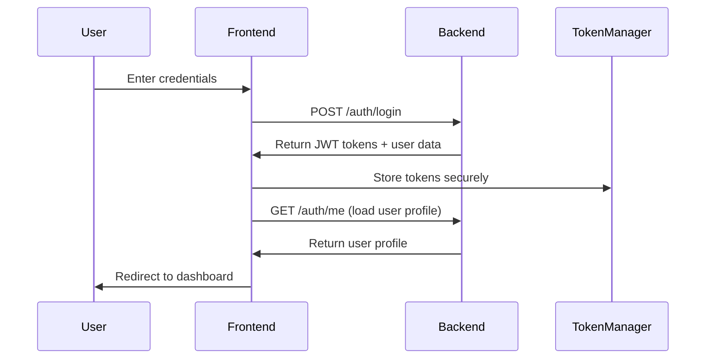
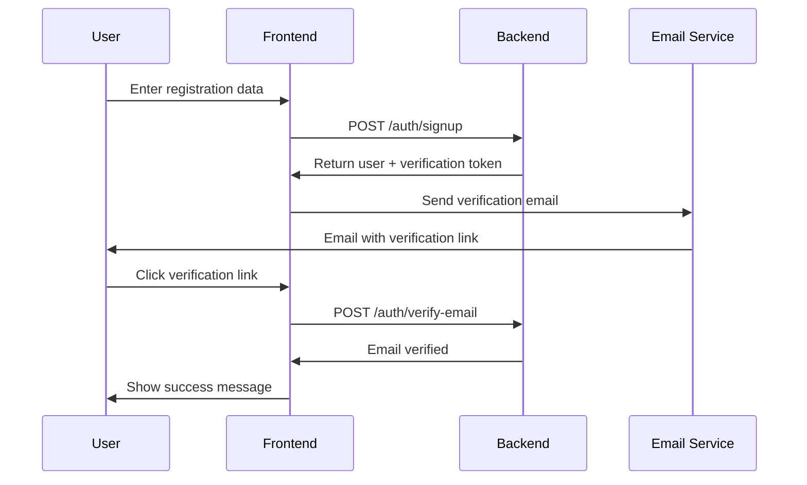
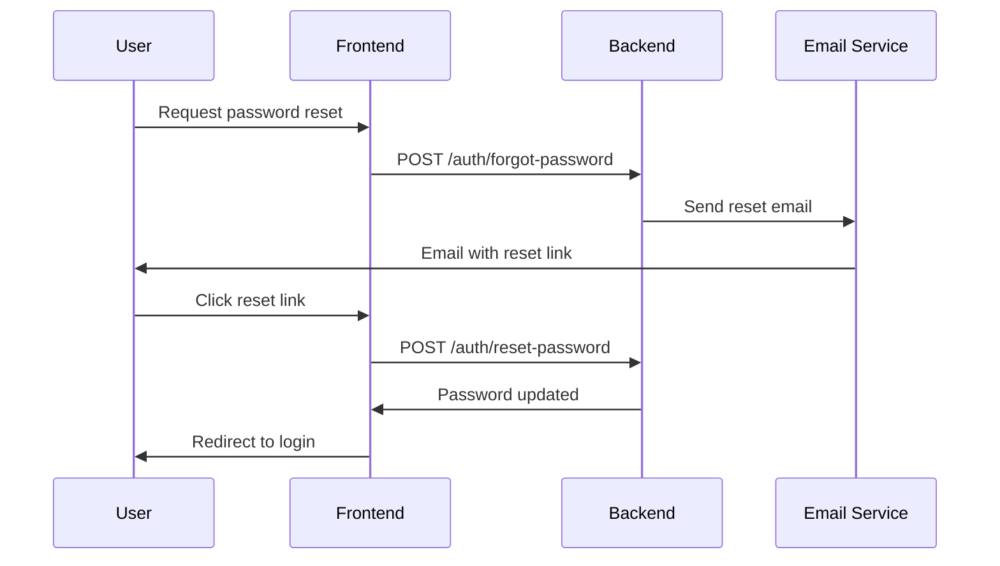
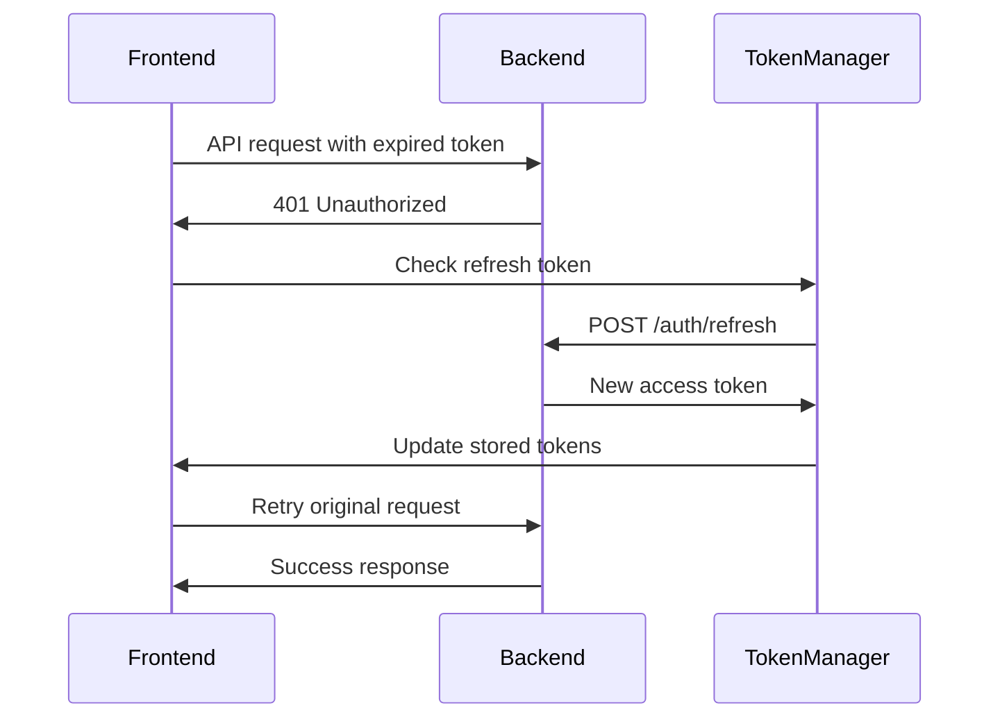

# ArzanSite Frontend Architecture Documentation

## Overview

ArzanSite is a React-based frontend application built with TypeScript, Vite, and Tailwind CSS. It provides a comprehensive website builder platform with user authentication, order management, and design tools. The frontend communicates with a NestJS backend API.

## Technology Stack

### Core Technologies
- **React 18.3.1** - UI framework
- **TypeScript 5.5.3** - Type safety
- **Vite 5.4.1** - Build tool and dev server
- **Tailwind CSS 3.4.11** - Styling framework
- **React Router DOM 6.26.2** - Client-side routing

### Key Dependencies
- **@tanstack/react-query** - Data fetching and caching
- **Framer Motion** - Animations
- **Radix UI** - Accessible UI components
- **React Hook Form** - Form management
- **Zod** - Schema validation
- **Lucide React** - Icons

## Project Structure

```
src/
├── components/           # Reusable UI components
│   ├── ui/              # Base UI components (Radix-based)
│   ├── dashboard/       # Dashboard-specific components
│   ├── wizard/          # Website builder wizard components
│   └── ProtectedRoute.tsx
├── hooks/               # Custom React hooks
│   ├── useAuth.tsx      # Authentication hook
│   ├── useSiteMode.tsx  # Site mode management
│   └── use-toast.ts     # Toast notifications
├── lib/                 # Utility libraries
│   ├── api-client.ts    # API client for backend communication
│   ├── tokenManager.ts  # JWT token management
│   ├── auth.ts          # Authentication utilities
│   └── types.ts         # TypeScript type definitions
├── pages/               # Page components
│   ├── Auth.tsx         # Sign-in/Sign-up page
│   ├── Dashboard.tsx    # User dashboard
│   ├── AdminDashboard.tsx # Admin dashboard
│   ├── ForgotPassword.tsx
│   ├── ResetPassword.tsx
│   └── Wizard.tsx       # Website builder
└── main.tsx            # Application entry point
```

## Authentication System

### Architecture Overview

The authentication system is built around a custom NestJS backend with JWT tokens. It uses a context-based approach with React hooks for state management.

### Key Components

#### 1. AuthProvider (`src/hooks/useAuth.tsx`)

The main authentication context provider that manages:
- User state and profile
- Authentication status
- Token management
- Role-based access control

**Key Features:**
- Automatic token refresh
- Role-based redirects (user/admin)
- Email verification handling
- Password reset functionality

#### 2. API Client (`src/lib/api-client.ts`)

Comprehensive REST client for backend communication:

**Base URL:** `https://nest.arzansite.com/api`

**Key Endpoints:**
```typescript
// Authentication
POST /auth/login
POST /auth/signup
POST /auth/refresh
POST /auth/logout
POST /auth/forgot-password
POST /auth/reset-password
POST /auth/verify-email
GET /auth/me

// User Management
GET /profiles/me
PATCH /profiles/me
GET /profiles

// Orders
GET /orders
POST /orders
GET /orders/:id
PATCH /orders/:id
DELETE /orders/:id

// Wallet
GET /wallets/me/balance
GET /wallets/me/transactions
POST /wallets/me/transactions
POST /wallets/me/balance

// Payments
POST /payments
GET /payments/:id
POST /payments/request
POST /payments/verify
```

#### 3. Token Manager (`src/lib/tokenManager.ts`)

Secure token storage and management:

**Storage Strategy:**
- Access tokens: `sessionStorage` (cleared on page refresh)
- Refresh tokens: `localStorage` (persistent)
- Expiration tracking: Automatic JWT expiration detection

**Features:**
- Automatic token refresh
- Concurrent request handling
- Secure token storage
- Expiration management

### Authentication Flow

#### 1. Sign-In Flow



**Implementation:**
```typescript
const signIn = async (email: string, password: string) => {
  const response = await apiClient.signIn(email, password);
  
  if (response?.access_token) {
    tokenManager.setTokens({
      access_token: response.access_token,
      refresh_token: response.refresh_token,
    });
    await loadUser();
    return { user: response.user, redirect: response.redirect };
  }
};
```

#### 2. Sign-Up Flow



**Implementation:**
```typescript
const signUp = async (email: string, password: string, metadata?: Record<string, unknown>) => {
  const response = await apiClient.signUp(email, password, metadata);
  
  // Send verification email if token provided
  if (response.verificationToken) {
    await this.sendEmail({
      to: email,
      subject: 'تایید ایمیل - Arzan Site',
      template: 'verification',
      data: {
        userEmail: email,
        actionUrl: `${window.location.origin}/verify-email?token=${response.verificationToken}`,
        expirationTime: '24 ساعت',
      },
    });
  }
  
  return response;
};
```

#### 3. Password Reset Flow



**Implementation:**
```typescript
// Request reset
const forgotPassword = async (email: string) => {
  await apiClient.forgotPassword(email);
};

// Reset password
const resetPassword = async (token: string, newPassword: string) => {
  await apiClient.resetPassword(token, newPassword);
};
```

#### 4. Token Refresh Flow



**Implementation:**
```typescript
private async request<T>(endpoint: string, options: RequestInit = {}, retryOn401 = true): Promise<T> {
  const response = await fetch(url, config);
  
  if (response.status === 401 && retryOn401) {
    const refreshToken = tokenManager.getRefreshToken();
    if (refreshToken && !this.isRefreshing) {
      this.isRefreshing = true;
      try {
        const refreshed = await this.refreshToken(refreshToken);
        tokenManager.setTokens({
          access_token: refreshed.access_token,
          refresh_token: refreshed.refresh_token,
        });
        return this.request<T>(endpoint, options, false);
      } catch (refreshError) {
        this.clearToken();
        window.location.href = '/auth';
      } finally {
        this.isRefreshing = false;
      }
    }
  }
}
```

### Data Models

#### User Profile
```typescript
interface BackendUserProfile {
  id: string;
  email: string;
  role: 'user' | 'admin';
  first_name?: string;
  last_name?: string;
  phone?: string;
  address?: string;
  company?: string;
  bio?: string;
  user_metadata?: Record<string, unknown>;
  email_confirmed_at?: string | null;
  created_at: string;
  updated_at: string;
}
```

#### Authentication Response
```typescript
interface AuthResponse {
  access_token: string;
  refresh_token?: string;
  user: BackendUserProfile;
  redirect?: {
    url: string;
    message: string;
  };
}
```

#### Order Data
```typescript
interface Order {
  id: string;
  title: string;
  description: string;
  price: number;
  status: 'pending' | 'in_progress' | 'completed' | 'cancelled';
  payment_status?: string;
  comments?: string;
  total_pages?: number;
  total_sections?: number;
  user_id: string;
  created_at: string;
  updated_at: string;
}
```

#### Design Data
```typescript
interface DesignData {
  layout?: string;
  colors?: Record<string, string>;
  components?: Array<{
    type: string;
    content?: string;
    image?: string;
  }>;
  settings?: Record<string, unknown>;
  pages?: Array<{
    id: string;
    name: string;
    sections: Array<{
      id: string;
      sectionType: string;
      layoutId: string;
      order: number;
      customData?: Record<string, unknown>;
    }>;
    canvasDimensions: {
      width: number;
      height: number;
    };
  }>;
  currentPageId?: string;
}
```

## Routing System

### Route Structure
```typescript
<Routes>
  <Route path="/" element={<Index />} />
  <Route path="/wizard" element={<Wizard />} />
  <Route path="/auth" element={<Auth />} />
  <Route path="/forgot-password" element={<ForgotPassword />} />
  <Route path="/reset-password" element={<ResetPassword />} />
  <Route path="/verify-email" element={<VerifyEmail />} />
  <Route path="/dashboard" element={
    <ProtectedRoute>
      <Dashboard />
    </ProtectedRoute>
  } />
  <Route path="/admin" element={
    <ProtectedRoute requireAdmin={true}>
      <AdminDashboard />
    </ProtectedRoute>
  } />
  <Route path="/payment-callback" element={<PaymentCallback />} />
  <Route path="*" element={<NotFound />} />
</Routes>
```

### Protected Routes
The `ProtectedRoute` component handles:
- Authentication checks
- Role-based access control
- Loading states
- Automatic redirects

```typescript
const ProtectedRoute = ({ children, requireAdmin = false }: ProtectedRouteProps) => {
  const { user, loading: authLoading, userRole, roleLoading } = useAuth();
  const location = useLocation();

  if (authLoading || roleLoading) {
    return <LoadingSpinner />;
  }

  if (!user) {
    return <Navigate to="/auth" replace state={{ from: location }} />;
  }

  if (requireAdmin && userRole?.role !== 'admin') {
    return <Navigate to="/dashboard" replace />;
  }

  return <>{children}</>;
};
```

## State Management

### Authentication State
Managed through React Context with the following state:
- `user`: Current user profile
- `loading`: Authentication loading state
- `userRole`: User role information
- `roleLoading`: Role loading state
- `isAuthenticated`: Boolean authentication status
- `error`: Error messages

### Global State
- **Site Mode**: Development, maintenance, or normal mode
- **Toast Notifications**: Global notification system
- **Query Cache**: React Query for API data caching

## Security Features

### Token Security
- Access tokens stored in `sessionStorage` (cleared on refresh)
- Refresh tokens stored in `localStorage` with expiration tracking
- Automatic token refresh before expiration
- Secure token transmission with Bearer authentication

### Route Protection
- Authentication required for protected routes
- Role-based access control for admin routes
- Automatic redirect to login for unauthenticated users

### Input Validation
- Client-side validation with Zod schemas
- Server-side validation for all API requests
- XSS protection through proper input sanitization

## Error Handling

### API Error Handling
```typescript
private async request<T>(endpoint: string, options: RequestInit = {}): Promise<T> {
  try {
    const response = await fetch(url, config);
    
    if (!response.ok) {
      if (response.status === 401) {
        // Handle authentication errors
        await this.handleAuthError();
      }
      
      const message = body?.message || `HTTP ${response.status}`;
      throw new Error(message);
    }
    
    return body as T;
  } catch (error) {
    console.error('API request failed:', error);
    throw error;
  }
}
```

### User Feedback
- Toast notifications for success/error states
- Loading states during async operations
- Form validation with real-time feedback
- Graceful error recovery

## Environment Configuration

### Environment Variables
```bash
VITE_API_URL=https://nest.arzansite.com/api
```

### Build Configuration
- **Development**: Hot reload with Vite dev server
- **Production**: Optimized build with code splitting
- **Preview**: Local preview of production build

## Integration with NestJS Backend

### API Communication
- RESTful API endpoints
- JWT-based authentication
- Automatic token refresh
- Error handling and retry logic

### Data Flow
1. **Authentication**: JWT tokens for session management
2. **User Management**: Profile CRUD operations
3. **Order System**: Order creation, management, and tracking
4. **Design System**: Website builder data persistence
5. **Payment Integration**: ZarinPal payment gateway
6. **Email System**: Transactional emails for verification and notifications

### Backend Requirements
The NestJS backend must implement:
- JWT authentication with refresh tokens
- User management with role-based access
- Order management system
- Design data persistence
- Payment gateway integration
- Email service integration
- File upload handling
- Rate limiting and security measures

## Development Guidelines

### Code Organization
- **Components**: Reusable UI components in `src/components/`
- **Hooks**: Custom React hooks in `src/hooks/`
- **Utilities**: Helper functions in `src/lib/`
- **Pages**: Route components in `src/pages/`
- **Types**: TypeScript definitions in `src/lib/types.ts`

### Styling
- **Tailwind CSS**: Utility-first CSS framework
- **Component Variants**: Using `class-variance-authority`
- **Responsive Design**: Mobile-first approach
- **Dark Mode**: Theme support with `next-themes`

### Performance
- **Code Splitting**: Route-based lazy loading
- **Image Optimization**: Responsive images and lazy loading
- **Caching**: React Query for API data caching
- **Bundle Optimization**: Tree shaking and minification

This documentation provides a comprehensive overview of the ArzanSite frontend architecture, authentication system, and integration requirements for the NestJS backend.
